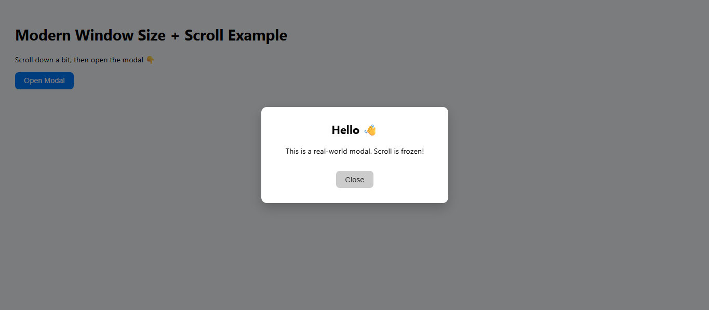

# DOM Geometry Example

This is a simple JavaScript example project that demonstrates how to read and work with **DOM geometry properties** such as `offsetWidth`, `clientWidth`, and `scrollWidth`.

The project shows how these properties are used in real web development to measure element sizes and handle layout calculations without relying on CSS styles directly.

---

## 🚀 Features
- Demonstrates reading element width and height using JavaScript.  
- Shows how `client`, `offset`, and `scroll` properties differ.  
- Clean, minimal HTML/CSS/JS structure for learning and testing.

---

## 🧠 Concepts Covered
- `offsetWidth` / `offsetHeight`  
- `clientWidth` / `clientHeight`  
- `scrollWidth` / `scrollHeight`  
- Understanding the difference between visible size, total content size, and scrolled area.

---

## Notes

This is a learning example, not a production-ready project.
It’s meant to help beginners understand how the browser measures elements and how JavaScript interacts with layout geometry.

---

